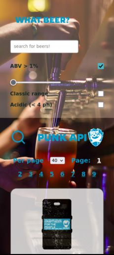

# PUNK API

### David Williams - Feb 2021

## About this project

This project utilizes the open-source [Punk API](https://punkapi.com/documentation/v2) from brewdog, allowing you to search and filter beers according to paramaters - in this version ABV, acidity and year brewed. There is also functionality to change items displayed per page.
This version (as per branch 'one-fetch') gets all of the data in one looped fetch request and uses custom filters to search and paginate. The second version (as branch 'with-api-funcs') is still under development, but will use the Punk API methods to do the same things.

**TO DO**
Create logic for multiple filters, add dyanamic routing to view the contents of selected beer

## Technologies

**React**, **JSX**, **HTML**, **SCSS**, **Javascript**

## Credits

**fonts**

- open-source fonts _Gudea_ and _Rowdies_ courtesy of [Google fonts](https://fonts.google.com/)

## Screenshots

### Mobile

### Desktop

